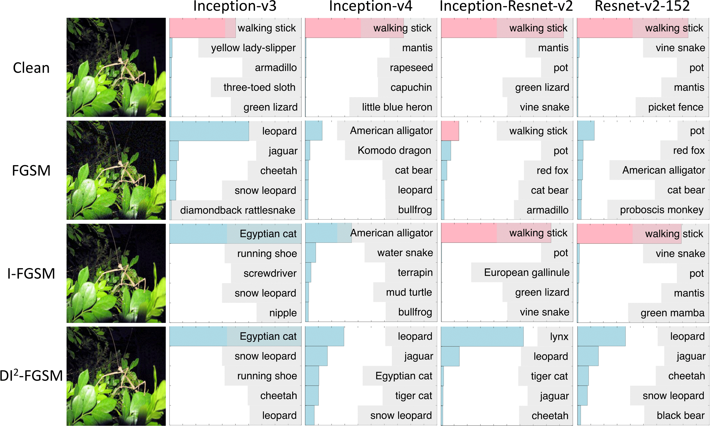

# Improving Transferability of Adversarial Examples with Input Diversity

This paper proposed to improve the transferability of adversarial examples by creating diverse input patterns (https://arxiv.org/abs/1803.06978). Instead of only using the original images to generate adversarial examples, the proposed method, Diverse Input Iterative Fast Gradient Sign
Method (DI2-FGSM), applies random transformations to the input images at each iteration. The generated adversarial examples are much more transferable than those generated by FGSM and I-FGSM. An example is shown below:

## Extension
To improve the transferability further, we
- integrate momentum term into the attack process (https://arxiv.org/abs/1710.06081); 
- attack multiple networks simultaneously (https://arxiv.org/abs/1611.02770).

By evaluating this enhanced attack w.r.t. the top 3 defense submissions and 3 official baselines from NIPS 2017 adversarial competition (https://www.kaggle.com/c/nips-2017-non-targeted-adversarial-attack), it reaches an average success rate of 73.0%, which outperforms the top 1 attack submission in the NIPS competition by a large margin of 6.6%. Please refer to the Table 3 in the paper for details. 

## Relationships between different attacks

Different attacks can be related via different parameter settings, as shown below:

## Inception_v3 model

- http://download.tensorflow.org/models/inception_v3_2016_08_28.tar.gz

## Citing this work

If you find this work is useful in your research, please consider citing:

    @inproceedings{xie2019improving,
        title={Improving Transferability of Adversarial Examples with Input Diversity},
        author={Xie, Cihang and Zhang, Zhishuai and Wang, Jianyu and Zhou, Yuyin and Ren, Zhou and Yuille, Alan},
        booktitle = {Computer Vision and Pattern Recognition},
        year={2019},
        organization={IEEE}
    }
